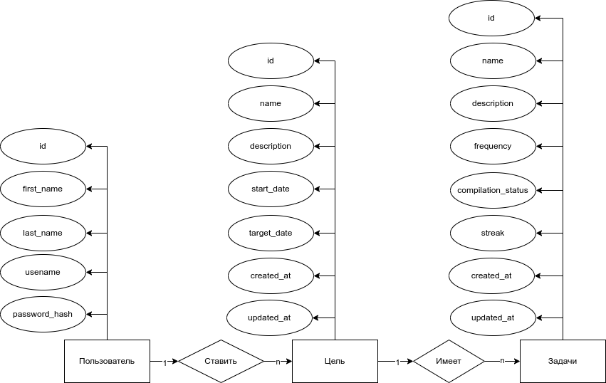
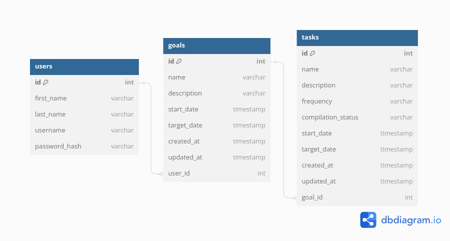
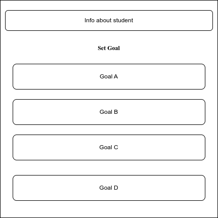
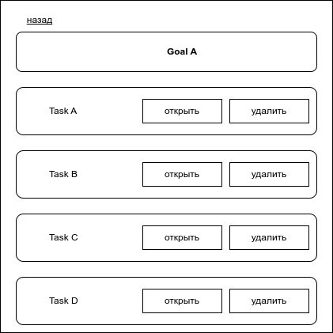
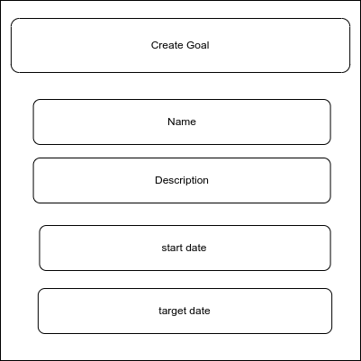

# Трекер целей (Goal tracker)

- **цель работы:**  В контексте приложения для отслеживания личных целей и привычек Пользователь играет центральную роль.

- **перечень функциональных требований:**

  1. Обеспечить Пользователю возможность создание, изменение и удаление личных целей.
  2. Обеспечить Пользователю возможность создание, изменение и удаление привычки связано с целю.
  3. Обеспечить Пользователю возможность регистарции и вход в систему.
- **use-case diagram**

  
- **BPMN диаграмма основных бизнес-процессов**
		- 
- **Диаграмма БД**
  
- **ER-диаграмма сущностей**

  
- **Компонентная диаграмма системы**
  

- **Экраны будущего web-приложения**
  -  **страница авторизации** 
  	- 
  - **Цели пользователя** 
  	- 
  - **задачи целя** 
  	- 
  -  **страница создание или изменение цель** 
  	- 
  -  **страница создание или изменение задачи** 
 	- 
