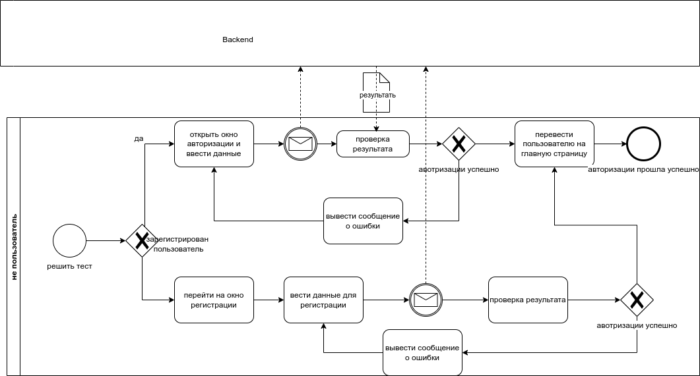
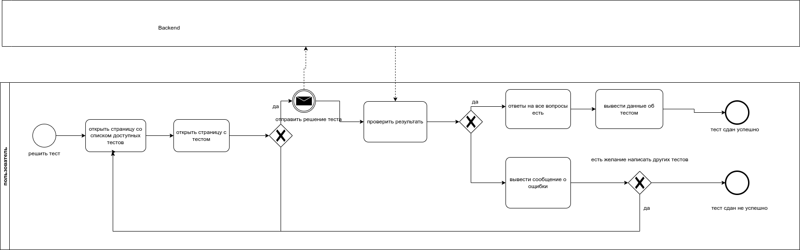
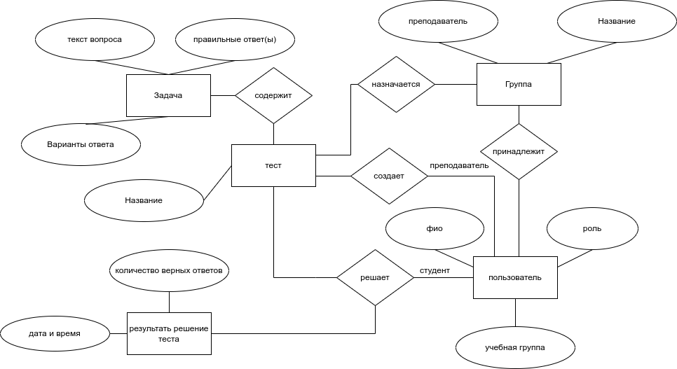
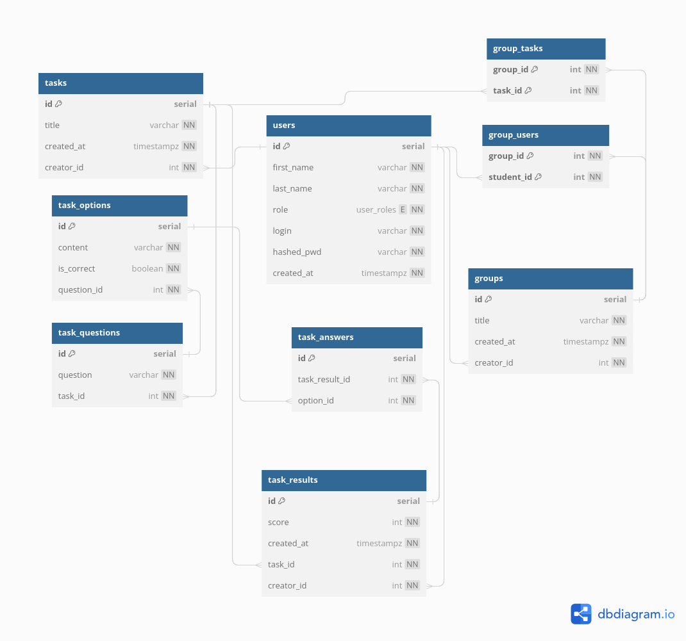
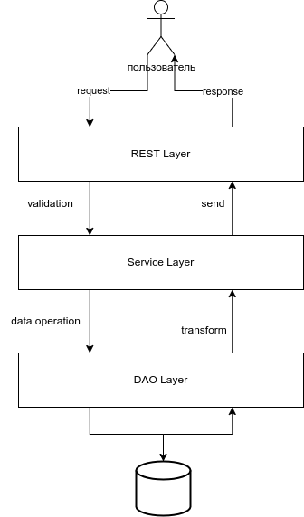
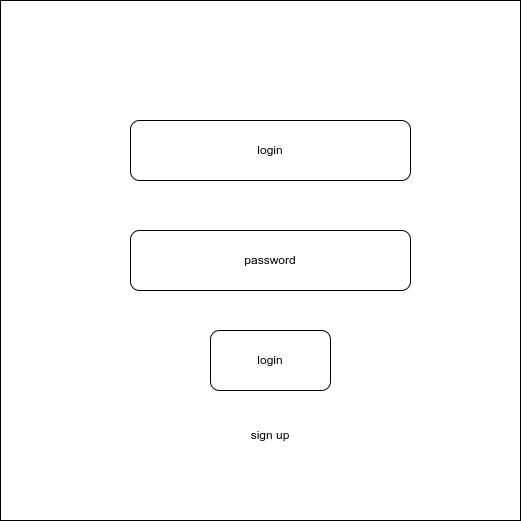
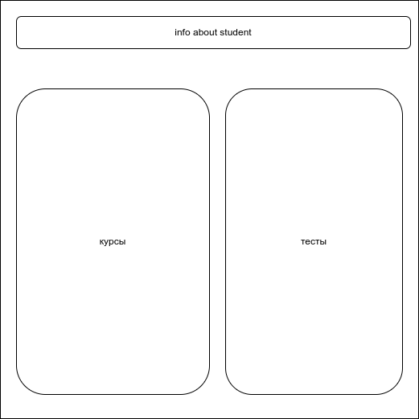
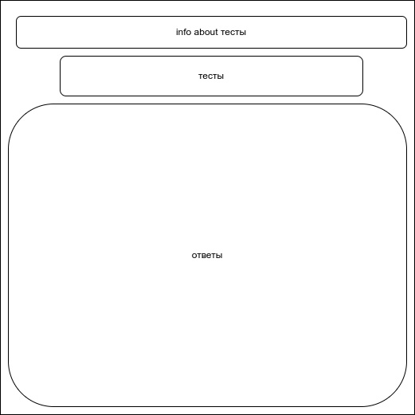
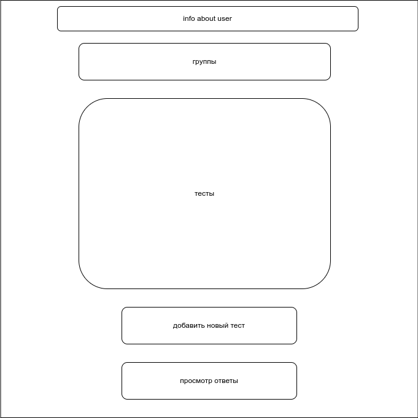
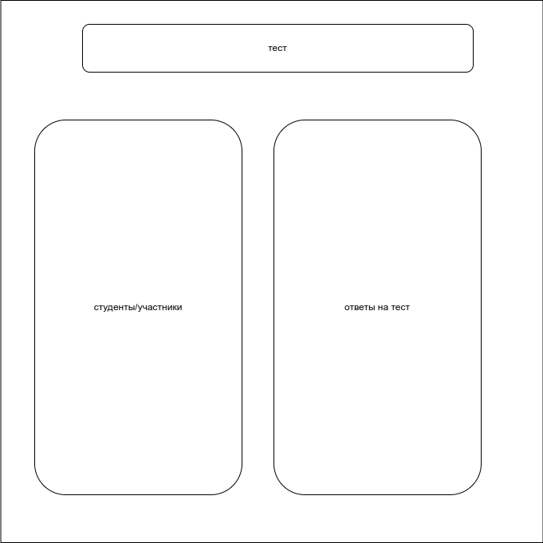

# Система управления задачами (Task managment system)

- **цель работы:**  облегчить преподавателям и пользователям контроль за выполнением задания и предоставить студенту функционал для облегчения получения информации о задачи;
- **перечень функциональных требований:**

  1. Обеспечить администратору возможность регистрирования новых пользователей, а также созданию учебные группы.
  2. Обеспечить преподавателю возможность добавлять в систему тесты, добавлять задачи и проверяет статус выполнение задач.
  3. Предоставить студенту возможность решать задачи, читать задачи и проверить результаты.
- **use-case diagram**

  
- **BPMN диаграмма основных бизнес-процессов**
	- авотризации
		- 
	- решить тест
		- 
- **Диаграмма БД**
  
- **ER-диаграмма сущностей**

  
- **Компонентная диаграмма системы**
  

- **Экраны будущего web-приложения**
  -  **страница авторизации** 
  	- 
  - **курсы студента** 
  	- 
  - **тесты студента** 
  	- 
  -  **страница преподавалтели/менторы** 
  	- 
  -  **страница ответы на тесты** 
 	- 
