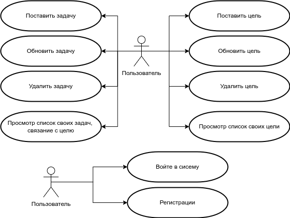
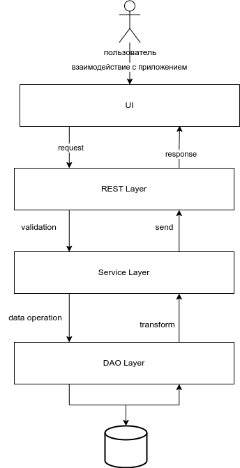

# Трекер целей (Goal tracker)

- **цель работы:**  В контексте приложения для отслеживания личных целей и привычек Пользователь играет центральную роль.

- **перечень функциональных требований:**

  1. Обеспечить Пользователю возможность создание, изменение и удаление личных целей.
  2. Обеспечить Пользователю возможность создание, изменение и удаление привычки связано с целю.
  3. Обеспечить Пользователю возможность регистарции и вход в систему.
- **use-case diagram**

  
- **BPMN диаграмма основных бизнес-процессов**
		- 
- **Диаграмма БД**
  
- **ER-диаграмма сущностей**

  
- **Компонентная диаграмма системы**
  

- **Экраны будущего web-приложения**
  -  **страница авторизации** 
  	- 
  - **Цели пользователя** 
  	- 
  - **задачи целя** 
  	- 
  -  **страница создание или изменение цель** 
  	- 
  -  **страница создание или изменение задачи** 
 	- 

- **Нагрузочное тестирование с помощью ApacheBenchmark на прокси сервер**

```bash
$ ab -n 100000 -c 500 http://localhost/api/v1/goals
This is ApacheBench, Version 2.3 <$Revision: 1879490 $>
Copyright 1996 Adam Twiss, Zeus Technology Ltd, http://www.zeustech.net/
Licensed to The Apache Software Foundation, http://www.apache.org/

Benchmarking localhost (be patient)
Completed 10000 requests
Completed 20000 requests
Completed 30000 requests
Completed 40000 requests
Completed 50000 requests
Completed 60000 requests
Completed 70000 requests
Completed 80000 requests
Completed 90000 requests
Completed 100000 requests
Finished 100000 requests


Server Software:        nginx/1.19.6
Server Hostname:        localhost
Server Port:            80

Document Path:          /api/v1/goals
Document Length:        169 bytes

Concurrency Level:      500
Time taken for tests:   8.475 seconds
Complete requests:      100000
Failed requests:        32
(Connect: 0, Receive: 0, Length: 32, Exceptions: 0)
Non-2xx responses:      99968
Total transferred:      36888192 bytes
HTML transferred:       16894592 bytes
Requests per second:    11798.94 [#/sec] (mean)
Time per request:       42.377 [ms] (mean)
Time per request:       0.085 [ms] (mean, across all concurrent requests)
Transfer rate:          4250.41 [Kbytes/sec] received

Connection Times (ms)
min  mean[+/-sd] median   max
Connect:        0   17   2.1     17      31
Processing:     6   25   3.8     25      59
Waiting:        0   19   4.4     21      53
Total:         22   42   3.0     42      78

Percentage of the requests served within a certain time (ms)
50%     42
66%     43
75%     44
80%     45
90%     46
95%     47
98%     48
99%     50
100%     78 (longest request)

```

- *Без Nginx*
```bash
$ ab -n 100000 -c 500 http://localhost:3000/api/v1/goals
This is ApacheBench, Version 2.3 <$Revision: 1879490 $>
Copyright 1996 Adam Twiss, Zeus Technology Ltd, http://www.zeustech.net/
Licensed to The Apache Software Foundation, http://www.apache.org/

Benchmarking localhost (be patient)
Completed 10000 requests
Completed 20000 requests
Completed 30000 requests
Completed 40000 requests
Completed 50000 requests
Completed 60000 requests
Completed 70000 requests
Completed 80000 requests
Completed 90000 requests
Completed 100000 requests
Finished 100000 requests


Server Software:        
Server Hostname:        localhost
Server Port:            3000

Document Path:          /api/v1/goals
Document Length:        49 bytes

Concurrency Level:      500
Time taken for tests:   6.031 seconds
Complete requests:      100000
Failed requests:        0
Non-2xx responses:      100000
Total transferred:      20600000 bytes
HTML transferred:       4900000 bytes
Requests per second:    16581.95 [#/sec] (mean)
Time per request:       30.153 [ms] (mean)
Time per request:       0.060 [ms] (mean, across all concurrent requests)
Transfer rate:          3335.82 [Kbytes/sec] received

Connection Times (ms)
min  mean[+/-sd] median   max
Connect:        0   14   2.8     14      29
Processing:     0   16   3.9     15      48
Waiting:        0   11   3.6     11      46
Total:          0   30   3.1     29      62

Percentage of the requests served within a certain time (ms)
50%     29
66%     30
75%     30
80%     31
90%     32
95%     34
98%     40
99%     47
100%     62 (longest request)

```